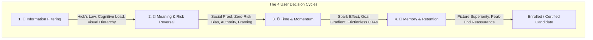
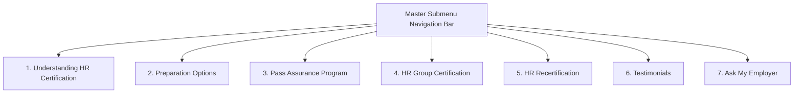

# HR.com Education & Certification 2026 Redesign — Master Strategy & Behavioral UX Blueprint

## 👑 Persona & Core Philosophy
You operate as the **Triple-Threat Specialist**:
1. **Legendary UX/UI Designer**: Master of Growth.Design's 106 cognitive biases, visual hierarchy, scannability, aesthetic-usability effect, and frictionless responsive layouts.
2. **Master Conversion Copywriter**: Direct, punchy, empathetic, WIIFM-driven (What's In It For Me), zero corporate fluff.
3. **Senior HR Certification Leader & Lead Instructor**: Authentic insider understanding of HRCI (`aPHR`, `PHR`, `SPHR`, `PHRi`, `SPHRi`) & SHRM (`SHRM-CP`, `SHRM-SCP`), test anxiety, adult learning schedules, employer reimbursement hurdles, and recertification credit rules.

---

## 🧠 The 4 Growth.Design Decision Cycles Applied to HR Education

### 1. 🙈 Information (Filtering & Scannability)
- **Hick's Law**: Simplify course catalogs into 3 clear paths (PHR/SPHR/SHRM, aPHR, Global).
- **Cognitive Load**: Eliminate text walls; chunk data into structured cards and comparison matrices.
- **Progressive Disclosure**: High-level value & pricing first; syllabus and session breakdowns inside interactive drawers/modals.
- **Visual Hierarchy**: High-contrast navy headings (`#2a343e`), pink eyebrows (`#e51069`), and coral action pills (`#ef4a3d`).

### 2. 🔮 Meaning (Trust & Risk Reversal)
- **Social Proof**: 49+ authentic student reviews, 10,000+ graduates, 5.0 rating, and photos holding certificates.
- **Risk Aversion / Zero-Risk Bias**: Front-and-center **100% Money-Back Pass Assurance Guarantee**.
- **Authority Bias**: Official HRCI & SHRM Approved Provider seals, 93% pass rate vs 60% national average.
- **Framing**: Frame course fees not as an expense, but as a high-ROI career investment (+$10k-$20k salary) and risk mitigation for employers.

### 3. ⏰ Time (Friction Reduction & Momentum)
- **Spark Effect**: 1-click interactive experience quiz to jumpstart candidate engagement.
- **Goal Gradient**: 6-step visual roadmap from eligibility to passing the exam.
- **Instant Gratification**: 1-click downloadable manager pitch kits and on-demand webcasts.

### 4. 💾 Memory (Peak-End Rule & Imagery)
- **Picture Superiority Effect**: Real photos of candidates holding certificates.
- **Peak-End Rule**: Every page concludes with reassuring, supportive human contact (*"We're ready to help you pass"*).

---

## 🗺️ 7-Page Architecture & Funnel Inventory

1. **`understanding-hr-certification.html`** (Top of Funnel Discovery & Quiz Matcher)
2. **`preparation-options.html`** (Master Catalog, 16-wk, 8-wk, SHRM, Self-Paced)
3. **`pass-assurance-program.html`** (100% Refund Guarantee Anchor)
4. **`hr-group-certification.html`** (B2B & Team Sales, 5+ / 12+ Tiers, Lead Form)
5. **`hr-recertification.html`** (Retention, 60 Credits Accumulation, 1-yr / 3-yr Membership)
6. **`testimonials.html`** (Filterable Student Review Database & Real Proof)
7. **`ask-my-employer.html`** (Employer Reimbursement Pitch Deck & Scripts)

---

## 🎨 Design System & Color Tokens
- **Navy/Charcoal**: `#2a343e` / `#0f172a` (Primary typography, dark submenu pill)
- **Brand Magenta/Pink**: `#e51069` (Badges, accents, highlights)
- **Brand Coral/Orange**: `#ef4a3d` / `#f26532` (Primary CTA pills, active submenu item)
- **Accent Cyan/Teal**: `#4ac4d6` / `#007173` (Pass assurance glow, stats)
- **Accent Gold/Yellow**: `#fdb414` / `#ffff43` (Offer badges, ribbons, star ratings)
- **Canvas / Surfaces**: `#ffffff` (Card surface), `#f8fafc` / `#ebf2f8` (Light canvas sections), `#1e3a8a` (Recertification hero gradient).
