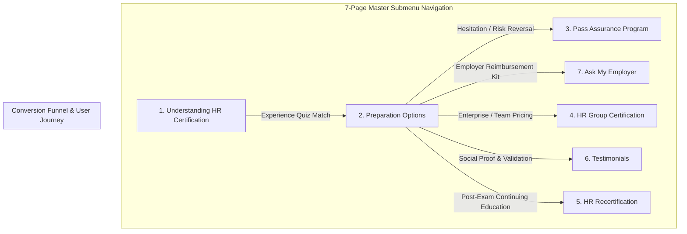

# HR.com Education & Certification 2026 Redesign — Master Blueprint & Current State Analysis

> **Project Scope**: Comprehensive overhaul and modernization of the 7 core HR.com Education & Certification pages.  
> **Repository Location**: `e:\HR\00-html\01-education\`  
> **Reference Screenshots**: `e:\HR\00-html\01-education\00-certification-2026-redesign\reference\`  
> **Source HTML Pages**: `e:\HR\00-html\01-education\main-pages\`  
> **Master Skill**: [SKILL.md](file:///e:/HR/00-html/.agents/skills/education-pages-revamp/SKILL.md)

---

## 1. Executive Summary & Ecosystem Overview

The **HR.com Education & Certification Suite** is an integrated 7-page funnel designed to educate, convert, support, and retain HR professionals pursuing industry-recognized credentials (**HRCI: aPHR, PHR, SPHR, PHRi, SPHRi** and **SHRM: SHRM-CP, SHRM-SCP**).



---

## 2. Detailed Page-by-Page Analysis & Current State Audit

### Page 1: `understanding-hr-certification.html`
- **Screenshot Reference**: `01-understanding-hr-certification.jpeg`
- **Source HTML**: [`understanding-hr-certification.html`](file:///e:/HR/00-html/01-education/main-pages/understanding-hr-certification.html)
- **Current Layout & Visual Elements**:
  - **Submenu**: Floating dark navy pill bar with active coral pink state.
  - **Hero**: Confetti powder-explosion cutout of a woman smiling with H1 *"HR Certification. Your Ticket to Success!"* and dual action buttons (*"Not sure where to start?"* + *"Show all courses"*).
  - **Interactive Experience Matcher**: Standalone card with rounded red accent tab, prompt *"We'll help to determine which exam is right for you"*, and experience chips (`0-1 year`, `1-2 year`, `2-4 year`, `4-5 year`, `5-7 year`, `7+ year`).
  - **Why Earn HR Certification**: 4-dot brand motif with 4 value proposition cards (Earning power, career mobility, knowledge mastery, global network).
  - **Credential Breakdown**: Deep dive into individual exam prerequisites, target roles, and exam formats.
  - **FAQ Section**: 2-column accordion answering common eligibility and exam questions.
- **Revamp Strategy & Team Inputs (Eric & Shelley)**:
  - **Hero Rewrite**: *"HR Certification: What You NEED to Know"* + *"Discover the career benefits, the key choices to make, and valuable resources"*.
  - **Sequential 2-Choice Decision Architecture**:
    - *Important Choice #1*: Which Certification? (Interactive years-of-experience matcher).
    - *Important Choice #2*: How to Prepare? (3-tier comparison: Instructor-Led vs eLearning vs Self-Study).
  - **Video Explainer Slot**: 16:9 Landscape video on *Pros & Cons of Prep Options* (Produced by Greg Osmond).
  - **7 Best Practices Roadmap**: Replaces legacy 6-box pathway infographic.
  - **Shelley's 5 Cert Authority Resource Cards** *(New-tab `target="_blank"` link cards)*:
    1. *Piece 1: Why Get HR Certified?*
    2. *Piece 2: Get the facts on HR Certification*
    3. *Piece 3: Secrets to passing the HR Certification Exam (Top 3 differences/similarities HRCI vs SHRM)*
    4. *Piece 4: Secrets to passing the SHRM Certification Exam*
    5. *Piece 5: Secrets to passing the HRCI Certification Exam*


---

### Page 2: `preparation-options.html`
- **Screenshot Reference**: `02-preparation-options.jpeg`
- **Source HTML**: [`preparation-options.html`](file:///e:/HR/00-html/01-education/main-pages/preparation-options.html)
- **Current Layout & Visual Elements**:
  - **Hero**: Dark atmospheric backdrop with professional in yellow, Pass Assurance Guarantee Seal (*"Pass or Get Your Money Back*!"*), H1 *"Your HR Certification Exam Preparation Menu"*, and Savings banner (*"Unlock My Savings!"*).
  - **3 Quick-Action Cards**:
    1. *View all prep courses* (Direct jump link)
    2. *Which exam is right for you?* (Quiz modal trigger)
    3. *Prepare my team* (Group registration corner ribbon)
  - **Course Filter Pills**: `PHR/SPHR/SHRM` | `aPHR` | `PHRi / SPHRi`
  - **Course Product Grid (Multi-Tier Cards)**:
    - 16-Week Live Online (HRCI & SHRM)
    - 8- & 16-Week Live Online (SHRM Focus) with *"NEW"* gold corner ribbon
    - 8-Week Accelerated Live Online (HRCI & SHRM)
    - 10-Week aPHR Live Online
    - Self-Paced / Materials Only
    - *Card Features*: Instructor-led badge, level tag (Advanced), Money-Back guarantee badge, duration pill, starting price (`$1065 + Shipping`), availability, and *"View more"* CTA.
- **Revamp Opportunities**:
  - Create modern, responsive glassmorphic course cards with clear pricing tiers, feature comparison checklists, and next cohort start date callouts.

---

### Page 3: `pass-assurance-program.html`
- **Screenshot Reference**: `03-pass-assurance-program.jpeg`
- **Source HTML**: [`pass-assurance-program.html`](file:///e:/HR/00-html/01-education/main-pages/pass-assurance-program.html)
- **Current Layout & Visual Elements**:
  - **Card-Centric Guarantee Layout**: Standalone white card with rounded corners and subtle shadow.
  - **Left Column**: Official *"100% MONEY BACK Guarantee"* badge with teal/cyan radial glow.
  - **Right Column**:
    - Title: *"Pass Assurance Program"*
    - Guarantee Statement: 100% tuition refund if eligible candidate does not pass.
    - 3-Point Eligibility Checklist with cyan border:
      1. Attend 80%+ live sessions.
      2. Score 80%+ on practice exams.
      3. Attempt exam within 90 days of program completion.
    - Direct course links: 16-wk HRCI & SHRM, 8-wk HRCI & SHRM, 10-wk aPHR.
- **Revamp Opportunities**:
  - Enhance visual hierarchy with clear step-by-step icons, FAQ section on refund process, and student reassurance badges.

---

### Page 4: `hr-group-certification.html`
- **Screenshot Reference**: `04-hr-group-certification.jpeg`
- **Source HTML**: [`hr-group-certification.html`](file:///e:/HR/00-html/01-education/main-pages/hr-group-certification.html)
- **Current Layout & Visual Elements**:
  - **Hero**: Light cyan backdrop with team overhead circular table image, H1 *"An investment in your HR people is an investment in your business"*, supported credentials checklist (`aPHR`, `PHR`, `SPHR`, `SHRM-CP`, `SHRM-SCP`), and CTA *"Group rates available"*.
  - **Save with Group Rates**: Tiered incentives for 5+ learners and 12+ private cohorts.
  - **Dual Benefit Cards (2-Column Grid)**:
    - *Benefits for your organization* (Avoid compliance risk, boost retention, track key HR KPIs).
    - *Benefits for HR professionals* (Career advancement, consistency, team building).
  - **Why Certification vs Degree**: Cost and ROI comparison.
  - **B2B Lead Form**: Integrated `$vendorLeadForm` with custom CTA button.
- **Revamp Opportunities**:
  - Modernize the B2B lead capture module, add corporate client logos/social proof, and include a group discount calculator.

---

### Page 5: `hr-recertification.html`
- **Screenshot Reference**: `05-hr-recertification.jpeg`
- **Source HTML**: [`hr-recertification.html`](file:///e:/HR/00-html/01-education/main-pages/hr-recertification.html)
- **Current Layout & Visual Elements**:
  - **Hero**: Royal cobalt blue gradient with white `hr.education` logo, official HRCI & SHRM Recertification Provider seals, H1 *"HR Recertification Program"*, and contact hotline info.
  - **Floating Pricing & Brochure Bar**:
    - 1-Year Membership: `$250` -> CTA: `Pay: $250`
    - 3-Year Membership: `$500 (1 year free)` -> CTA: `Pay: $500`
    - Brochure Download Button.
  - **Features vs Recertification Requirements**:
    - Tab toggle between program features (400+ HRCI credits, 150+ SHRM credits, 50+ strategic, 20+ global, Ethics credits, automated credit tracking) and certification rules.
    - 3 Value Pillars: Lowest cost, Safe & Secure tracking, HR Approved.
- **Revamp Opportunities**:
  - Streamline pricing cards with clear feature breakdown (e.g., unlimited webcasts, ethics credits, on-demand vault), and add a credit calculator.

---

### Page 6: `testimonials.html`
- **Screenshot Reference**: `06-testimonials.jpeg`
- **Source HTML**: [`testimonials.html`](file:///e:/HR/00-html/01-education/main-pages/testimonials.html)
- **Current Layout & Visual Elements**:
  - **Hero**: Geometric light backdrop, H1 *"Trusted by 10,000+ HR Professionals Worldwide"*, 5.0 Star Rating, spotlight review, and visual honeycomb/hexagon collage of real students holding certificates.
  - **Filter Bar**: `All` | `PHR/SPHR/SHRM` | `aPHR`
  - **3-Column Testimonial Masonry Grid**: Student cards with headshot, name, full review quote, date, specific enrolled course badge (`10-wk aPHR ILT`, `HRCI & SHRM 8-Week Hybrid VILT`), and interactive detail arrows.
- **Revamp Opportunities**:
  - Implement smooth client-side filtering, video testimonial embeds, and pass rate statistics.

---

### Page 7: `ask-my-employer.html`
- **Screenshot Reference**: `07-ask-my-employer.jpeg`
- **Source HTML**: [`ask-my-employer.html`](file:///e:/HR/00-html/01-education/main-pages/ask-my-employer.html)
- **Current Layout & Visual Elements**:
  - **Hero**: Soft cool blue canvas with laptop professional cutout, H1 *"Convince Your Employer to Pay for Your HR Certification Prep Course"*, CTAs *"Download Template Now"* + *"Enroll Today"*.
  - **3 Pillar Stats**: 10,000+ trusted, 93% pass rate, Pass Assurance guarantee.
  - **3 Employer Pitch Cards**:
    1. *Reason 1: You'll be a better HR professional*
    2. *Reason 2: Mitigate legal & compliance risks*
    3. *Reason 3: Cost-effective talent development*
  - **Manager Email Proposal & Justification Template**: Copy-paste email scripts and talking points for boss approval.
- **Revamp Opportunities**:
  - Add interactive 1-click email template generator with customizable fields (Manager Name, Course Choice, Investment Amount).

---

## 3. Design System Tokens & Brand Standards

| Token Category | Value / Variable | Usage |
| :--- | :--- | :--- |
| **Primary Navy** | `#2a343e` / `#0f172a` | H1, H2, Submenu pill bar, dark text |
| **Brand Magenta/Pink** | `#e51069` | Eyebrows, key highlights, pricing badges |
| **Brand Coral/Orange** | `#ef4a3d` / `#f26532` | Primary CTA pill buttons, active submenu item |
| **Accent Teal/Cyan** | `#4ac4d6` / `#007173` | Pass assurance borders, subtle glow, stats |
| **Accent Gold/Yellow** | `#fdb414` / `#ffff43` | Badges, highlight pen brush, "NEW" ribbon |
| **Accent Green** | `#94c83d` | 4-dot brand signature, success checkmarks |
| **Light Canvas** | `#ffffff`, `#f8fafc`, `#ebf2f8` | Section backgrounds, card surfaces |
| **Deep Cobalt Blue** | `#1e3a8a` / `#2563eb` | Recertification hero gradient |
| **Font Family** | `'Roboto', -apple-system, sans-serif` | Clean, highly legible, CMS-compatible typography |

---

## 4. CMS Technical Guidelines & Reusability Matrix

1. **Full-Width Canvas Override**:
   ```css
   body > .ContentArea { margin: 0 !important; }
   body > .ContentArea > .container { width: 100% !important; max-width: 100% !important; padding: 0 !important; }
   ```
2. **Dynamic Tokens**:
   - `$public/remoteimages/...` — CDN hosted images and graphics.
   - `$desc_long` — Dynamic CMS story injection point.
   - `$vendorLeadForm` — Dynamic lead form for group sales.
3. **Scoping**:
   - Every page must use a dedicated root wrapper (e.g. `.edu-understanding`, `.edu-prep-options`, `.edu-pass-assurance`, `.edu-group-cert`, `.edu-recert`, `.edu-testimonials`, `.edu-ask-employer`).

---

## 5. Implementation Roadmap

- [x] **Phase 1: Discovery & Architecture Blueprint** (Completed — screenshots analyzed, skill & blueprint established).
- [ ] **Phase 2: Master Submenu & Universal Layout Framework** (Modernize the shared navigation bar and responsive wrapper).
- [ ] **Phase 3: Core Catalog & Conversion Engine** (`preparation-options.html` & `pass-assurance-program.html`).
- [ ] **Phase 4: Top-of-Funnel & Social Proof** (`understanding-hr-certification.html` & `testimonials.html`).
- [ ] **Phase 5: B2B, Retention & Employer Sponsorship** (`hr-group-certification.html`, `hr-recertification.html`, `ask-my-employer.html`).
