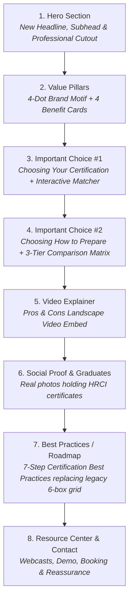

# Eric's Suggestions & Team Collaboration Notes: Understanding HR Certification Page

> **Target Page**: [`01-education/main-pages/understanding-hr-certification.html`](file:///e:/HR/00-html/01-education/main-pages/understanding-hr-certification.html)  
> **Source Google Doc**: [`01-education/00-certification-2026-redesign/reference/eric-suggestion-understanding-hr-certification-page.md`](file:///e:/HR/00-html/01-education/00-certification-2026-redesign/reference/eric-suggestion-understanding-hr-certification-page.md)  
> **Collaborators**: Eric Anderson (Lead Content Writer), Jennifer Marants (Course Director / Instructor), Greg Osmond (Video/Media Producer), Shelley Marsland (Team / Marketing Lead)

---

## 📌 Section-by-Section Breakdown of Eric's Proposed Changes

---

### 1. Hero Section Overhaul
- **Current Live Version**: Confetti powder explosion with woman leaning forward + headline *"HR Certification. Your Ticket to Success!"* + *"Which HR exam is right for you?"*.
- **Eric's Proposal**:
  - **New Headline**: **"HR Certification: What You NEED to Know"**
  - **New Subhead**: *"Discover the career benefits, the key choices to make, and valuable resources"*
  - **Dual CTAs**: `[Not Sure Where to Start?]` (Pill button) and `[View Courses]` (Outline button).
  - **New Imagery**: Professional woman in dark navy blazer pointing left towards the headline/value proposition.
  - **Team Comment (Eric Anderson)**: *"We should change this to promote the HR.com Certification Program page once we have that."*

---

### 2. Value Proposition Section ("Why earn an HR certification?")
- **Header**: 4-Dot HR.com Brand Signature (`#ef4a3d`, `#fdb414`, `#94c83d`, `#4ac4d6`).
- **Headline**: **"Why earn an HR certification?"**
- **Subhead**: *"HR certification isn't just a credential — it's a fast track to stronger skills, bigger opportunities, and the self-belief to take your career further."*
- **4 Benefit Cards**:
  1. **Earn More & Advance**: Certified HR pros earn $5,000–$20,000+ more annually and are more likely to be promoted.
  2. **Boost Your Expertise**: Strengthen HR knowledge to improve performance and provide more organizational value.
  3. **Stand Out From Your HR Peers**: Greater respect and major advantage when pursuing new roles (some require certification).
  4. **Gain Career Confidence**: Changes how you see yourself and elevates professional identity.

---

### 3. "Important Choice #1: Choosing Your Certification"
- **Title**: **Important choice #1: choosing your certification**
- **Subhead**: *"Both leading certification bodies — HRCI and SHRM — offer multiple options"*
- **Interactive Matcher Widget**:
  - Prompt: *"We'll help to determine which exam is right for you"*
  - Experience selector chips: `0-1 year` | `1-2 year` | `2-4 year` | `4-5 year` | `5-7 year` | `7+ year`
- **Team Comment (Eric Anderson)**: *"Want to improve the 'choosing your certification' quiz option."*

---

### 4. "Important Choice #2: Choosing How to Prepare for Your Exam"
- **Title**: **Important choice #2: choosing how to prepare for your exam**
- **Subhead**: *"The exams are hard. Choosing the right preparation method can make the difference between passing and failing."*
- **3-Column Comparison Matrix**:
  | Method | Core Value / Dynamic | Behavioral Reality |
  | :--- | :--- | :--- |
  | **Instructor-Led Course** | Highest pass rate of any prep method. | Instructors keep you on schedule, share tips, and work through tough concepts together. |
  | **On-Demand E-Learning** | Flexible for busy HR lives. | Requires self-discipline; no live coach to answer questions or keep you accountable. |
  | **Independent Study** | Most affordable option ($480). | Candidates who go it alone with text prep materials make up the largest share of those who have to retake the exam. |

---

### 5. Video Explainer ("Pros & Cons of Prep Options")
- **Heading**: *"Watch an in-depth video"*
- **Video Embed Slot**: `INSERT PROS & CONS OF PREP OPTIONS VIDEO WHEN READY`
- **Drive Link**: `https://drive.google.com/file/d/1JY9UUe4RbXnCfG9d8e0m_L12ZkxMag22/view`
- **Team Discussion (Greg Osmond)**:
  - *Greg's Note*: *"Update: the linked file is the vertical mobile cut, so it won't sit right on a desktop page. Rather than patch the old one I'm going to make a fresh landscape version of this pros-and-cons video and get it to you as soon as I get a chance. Will drop the new link here when it's ready."*

---

### 6. Social Proof & Pathway Refactoring
- **Section**: *"Hear from our graduates"* (Featuring authentic photos of Rochelle Harris and Gabriella Talentino holding certificates).
- **Eric's Critique on Legacy 6-Box Grid**:
  - Note: `FEEL LIKE WE NEED TO REMOVE OR REWORK THIS PATH ITEM. DOESN’T FIT REST OF PAGE, AND ONLY REFLECTS THE INSTRUCTOR-LED COURSE PATH.`
  - *Jennifer Marants' Note*: *"@eanderson@hr.com pathway info graph that I use in my demos"*

---

### 7. New Section: "Certification Best Practices We Couldn't Recommend More"
Eric proposes replacing the disjointed 6-box pathway with a clean, authoritative 7-step best-practices roadmap:

1. **Research the certifying institutes and requirements**: [View our Certification Comparison Chart](https://www.hr.com/en/certifications/certification-guidelines_icnmg6la.html).
2. **Verify you qualify** for the exam you have selected.
3. **Enroll in a prep program that offers a money-back guarantee**.
4. **Allow 4–6 months** of total preparation time.
5. **Sharpen your test-taking skills** in addition to studying the bodies of knowledge.
6. **Timing exam registration**: *(Eric's placeholder: "SOMETHING HERE ABOUT WHEN TO PAY FOR EXAM")* -> *Expert note: Don't start your 180-day exam testing window until you are midway through your prep course!*
7. **Plan for Recertification**: After achieving your credential, start banking credits early (required every 3 years).

- **Team Comment (Shelley Marsland)**: *"@JMArants@hr.com can you find the info graphic of this and share it?"*

---

### 8. Resource Center & Authority Content Cards (Shelley Marsland's Requirement)
- **Title**: **"Your certification resource center"**
- **Action Header**: Change header to *"We're ready to help you get certified"*.
- **Shelley's 5 Cert Authority Resource Cards** *(Opens in a new tab `target="_blank"` on click)*:
  1. **Cert Authority Piece 1**: *"Why Get HR Certified?"* (Career salary boost, employer respect, promotion readiness).
  2. **Cert Authority Piece 2**: *"Get the facts on HR Certification"* (National pass rates, requirements, governing bodies).
  3. **Cert Authority Piece 3**: *"Secrets to passing the HR Certification Exam (Top 3 differences & similarities between HRCI and SHRM exams)"*.
  4. **Cert Authority Piece 4**: *"Secrets to passing the SHRM Certification Exam"* (SHRM-CP & SHRM-SCP focus).
  5. **Cert Authority Piece 5**: *"Secrets to passing the HRCI Certification Exam"* (aPHR, PHR, SPHR focus).
- **Additional Interactive Support Widgets**:
  - Upcoming/on-demand webcast recordings
  - 1-on-1 consultation booking modal
  - Course demo preview link
  - FAQ accordion grid
  - Official trademark disclaimers

---

## 💡 UX & Conversion Analysis on Eric & Shelley's Suggestions (From Our Persona Lens)

| Proposal Item | Growth.Design / UX Assessment | Recommendation |
| :--- | :--- | :--- |
| **New Headline: "HR Certification: What You NEED to Know"** | **High Impact**: Moves away from generic slogan ("Ticket to Success") to high-curiosity, high-utility headline (**Curiosity Gap + Framing**). | ✅ **Approve & Enhance**: Pair with clear subhead emphasizing career salary acceleration (+$10k-$20k). |
| **"Important Choice #1" & "Important Choice #2" Framing** | **Brilliant Cognitive Ergonomics**: Uses **Chunking & Hick's Law** to simplify a confusing decision into 2 simple sequential steps: 1) Which exam? 2) How to study? | ✅ **Approve**: Build with distinct visual step badges (`Step 1`, `Step 2`). |
| **3-Tier Method Comparison Matrix** | **Masterful Framing**: Directly contrasts high pass rate of Instructor-Led against the hidden failure cost of Independent Study (**Loss Aversion**). | ✅ **Approve**: Format as a clean, responsive comparison card table with "Recommended" pill badge on Instructor-Led. |
| **Replacing 6-Box Infographic with 7 Best Practices** | **Removes Visual Clutter**: The old 6-box illustration felt like generic clip art. A clean step-by-step roadmap with actionable links provides higher utility and lower cognitive load. | ✅ **Approve**: Structure as an interactive timeline with a clear answer for Step 6 (Exam registration timing). |
| **Shelley's 5 Authority Article Cards** | **Authority Bias & Progressive Disclosure**: Gives curious, hesitating candidates bite-sized, deep-dive articles to educate themselves without cluttering the main decision flow. | ✅ **Approve**: Display as a modern 5-card horizontal/grid carousel with article reading time tags (e.g., `4 min read`) and external link icons (`target="_blank"`). |

